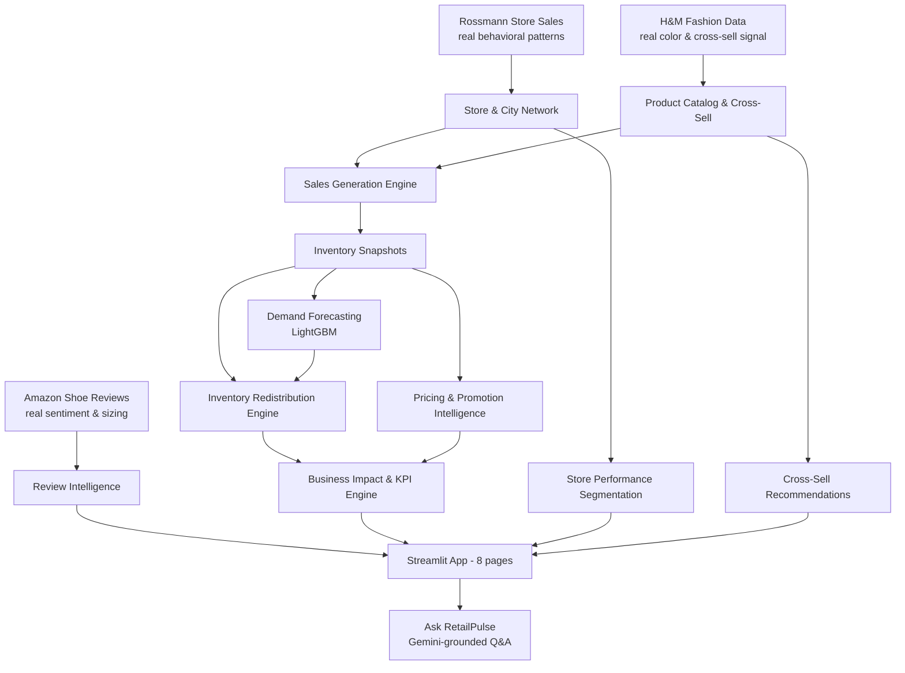

# RetailPulse 360

**A retail decision-intelligence platform for footwear retail** — demand forecasting, inventory redistribution, pricing intelligence, and business impact quantification, built end-to-end from real public datasets and documented, sourced assumptions.

[](https://retailpulse360.streamlit.app)
[](https://www.python.org/)
[](LICENSE)

**[Live App](https://retailpulse360.streamlit.app)** · **[LinkedIn](https://www.linkedin.com/in/hamazmubashar)**

---

## Overview

Retail chains with many stores face a recurring, expensive problem: demand doesn't match inventory. One store runs out of a bestseller while another sits on excess stock of the exact same item — creating lost sales on one side and tied-up capital on the other. The hard part isn't total-sales forecasting; it's demand across products, sizes, colors, stores, and seasons, and deciding what to actually *do* about the mismatch.

RetailPulse 360 is a full decision-intelligence pipeline that:
- **Forecasts** daily demand per store-product using a LightGBM model tuned for zero-inflated retail data
- **Recommends** specific, explainable inventory transfers between stores using real geography and logistics cost
- **Prices** slow-moving and dead stock differently based on real price-elasticity economics, not guesswork
- **Segments** stores by genuine behavioral performance, independent of store size
- **Recommends** cross-sell pairs grounded in real co-purchase behavior
- **Quantifies** the business impact of every phase in plain, individually-sourced metrics — including what it honestly *can't* do yet
- **Answers plain-English questions** about the business via a Gemini-powered assistant, grounded strictly in the platform's real data

Built as a from-scratch, anonymized simulation for a real footwear retailer (190+ stores across Pakistan), grounded entirely in real public datasets — nothing in this project is a fabricated number presented as fact.

## Architecture



## Key Modules

| Module | What it does | Real result |
|---|---|---|
| **Demand Forecasting** | LightGBM (Poisson objective) forecasts daily demand per store-product, using calendar, store-personality, and product features | 97.6% of predictions within 1 unit of actual; beats naive baseline by 6.5% (MAE) / 29.6% (RMSE) |
| **Inventory Redistribution** | Matches understocked stores to overstocked/dead stock elsewhere in the network, using real Haversine distance and greedy allocation | PKR 2,819,339 in revenue recovered from otherwise-dead stock; honestly addresses 4.2% of all shortages (the rest need real reordering) |
| **Pricing & Promotion** | Real price-elasticity economics (0.7, sourced) determine whether a discount preserves margin or should liquidate dead stock | PKR 16,084/day in margin preserved on slow-selling stock |
| **Store Segmentation** | K-means clustering on performance *relative to size-tier peers* (not raw revenue, which just re-derives store size) | 4 genuine behavioral segments: Rising Stars, Steady Performers, Lean & Consistent, At-Risk/Declining |
| **Cross-Sell Engine** | Category-level purchase affinity transferred from real H&M co-purchase behavior | 8 real category relationships powering "Customers Also Bought" |
| **Review Intelligence** | VADER sentiment on real Amazon shoe reviews, validated against star ratings | 8,208 reviews analyzed; sizing feedback explicitly flagged low-confidence (1.6% of reviews) rather than overstated |
| **Ask RetailPulse** | Gemini-powered natural-language Q&A, grounded strictly in the platform's real computed metrics | Answers cite real numbers; explicitly refuses to invent data it doesn't have |

## Tech Stack

| Layer | Tools |
|---|---|
| Data & ML | Python, pandas, NumPy, scikit-learn, LightGBM, statsmodels |
| Visualization | Plotly, Streamlit |
| AI Assistant | Google Gemini API (`google-genai`) |
| Geospatial | Haversine distance calculations, OpenStreetMap tiles |
| Deployment | Streamlit Community Cloud, Git LFS (large CSVs & model artifacts) |

## Data Sources

Every simulated value is either derived from a real public dataset or a documented, sourced assumption — never an invented number presented as fact.

| Source | Used for |
|---|---|
| [Rossmann Store Sales](https://www.kaggle.com/c/rossmann-store-sales) (Kaggle) | Store behavioral personalities: promo sensitivity, trend, volatility, day-of-week rhythm |
| [H&M Personalized Fashion Recommendations](https://www.kaggle.com/competitions/h-and-m-personalized-fashion-recommendations) (Kaggle) | Real color popularity and cross-sell co-purchase patterns |
| Amazon Men's/Women's Shoes Reviews (Kaggle) | Real customer sentiment and sizing feedback |
| Documented assumptions | Real Eid dates 2024-2026, Pakistani footwear sizing conventions, 40% gross margin (US Census/industry data), 0.7 price elasticity of demand for footwear (cited economics research) |

Raw datasets are excluded from this repo (see `.gitignore`) — download links are in `docs/`. Processed data and the trained model artifact are included via Git LFS.

## Project Structure

```
RetailPulse360/
├── app/                    # Streamlit application (8 pages)
│   ├── Dashboard.py
│   ├── pages/
│   └── utils/
├── notebooks/              # 13 notebooks, full analytical pipeline
├── datasets/processed/     # Cleaned, feature-engineered outputs (Git LFS)
├── artifacts/              # Trained model (Git LFS)
├── docs/                   # Data source links, notes
├── pitch/                  # Business narrative materials
├── requirements.txt
└── .gitattributes          # Git LFS tracking rules
```

## Running Locally

```bash
git clone https://github.com/hamazmubashar/RetailPulse360.git
cd RetailPulse360
conda create -n retailpulse python=3.11 -y
conda activate retailpulse
pip install -r requirements.txt
```

Create a `.env` file in the project root with your own Gemini API key (only needed for the Ask RetailPulse page):
```
GEMINI_API_KEY=your_key_here
```

Then run:
```bash
cd app
streamlit run Dashboard.py
```

## Honest Limitations

This project is deliberately transparent about what it can and can't do:
- Inventory redistribution addresses **4.2%** of understocked situations — most shortages genuinely have no network-wide surplus and need real reordering
- Liquidation-discount revenue impact for fully-dead stock **cannot be quantified** by the elasticity model used (it can only scale existing demand, not project new demand from zero)
- Sizing feedback is based on only 1.6% of reviews mentioning sizing — flagged as directional, not a reliable correction signal
- Sports and Men's Formal categories have no real H&M color/cross-sell signal — the app shows this honestly rather than fabricating one
- No individual customer-level data exists in this simulation — "segmentation" is store-level, not customer-level, by design

## Author

**Hamaz Mubashar** — [LinkedIn](https://www.linkedin.com/in/hamazmubashar) · [GitHub](https://github.com/hamazmubashar)

## License

MIT — see [LICENSE](LICENSE).
